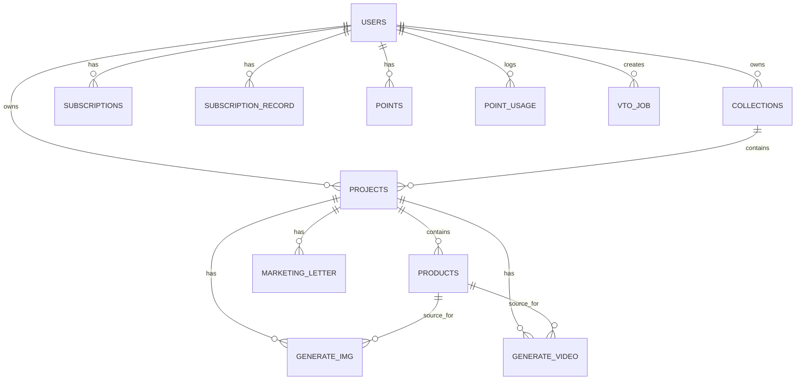

1. ## ERD



```code
CREATE EXTENSION IF NOT EXISTS "pgcrypto";

-- 1) USERS
CREATE TABLE users (
  id uuid PRIMARY KEY DEFAULT gen_random_uuid(),
  name text,
  last_name text,
  email text UNIQUE,
  profile_picture text,
  google_social jsonb,
  kakao_social jsonb,
  language varchar(10) DEFAULT 'ko',
  created_at timestamptz DEFAULT now(),
  updated_at timestamptz DEFAULT now(),
  deleted_at timestamptz NULL
);

-- 2) SUBSCRIPTIONS
CREATE TABLE subscriptions (
  id uuid PRIMARY KEY DEFAULT gen_random_uuid(),
  user_id uuid REFERENCES users(id) ON DELETE CASCADE,
  plan varchar(64),
  start_at timestamptz,
  end_at timestamptz,
  cancelled_at timestamptz,
  next_billing_at timestamptz,
  payments jsonb,
  invoices jsonb,
  cancel_reason text,
  status varchar(20) DEFAULT 'active',
  created_at timestamptz DEFAULT now(),
  updated_at timestamptz DEFAULT now()
);

-- 3) SUBSCRIPTION_RECORD (구독 변경 이력)
CREATE TABLE subscription_record (
  id uuid PRIMARY KEY DEFAULT gen_random_uuid(),
  user_id uuid REFERENCES users(id),
  subscription_id uuid REFERENCES subscriptions(id),
  from_plan varchar(64),
  to_plan varchar(64),
  payments jsonb,
  created_at timestamptz DEFAULT now()
);

-- 4) POINTS (보유 포인트 + 티켓)
CREATE TABLE points (
  user_id uuid PRIMARY KEY REFERENCES users(id) ON DELETE CASCADE,
  credit integer DEFAULT 0,
  look_book_ticket integer DEFAULT 0,
  video_ticket integer DEFAULT 0,
  updated_at timestamptz DEFAULT now()
);

-- 5) POINT_USAGE (포인트/티켓 사용 내역 - 회계ledger 역할)
CREATE TABLE point_usage (
  id uuid PRIMARY KEY DEFAULT gen_random_uuid(),
  user_id uuid REFERENCES users(id) ON DELETE CASCADE,
  job_id uuid NULL,   -- VTO job 등 사용이 연결된 경우
  usage_type varchar(32) NOT NULL, -- credit | look_book_ticket | video_ticket
  amount integer NOT NULL, -- -1, -5, +10 등
  reason text, -- vto_use, refund, admin_grant etc
  created_at timestamptz DEFAULT now()
);

CREATE INDEX ix_point_usage_user ON point_usage(user_id, created_at DESC);

-- 6) COLLECTIONS
CREATE TABLE collections (
  id uuid PRIMARY KEY DEFAULT gen_random_uuid(),
  user_id uuid REFERENCES users(id) ON DELETE CASCADE,
  name text,
  created_at timestamptz DEFAULT now(),
  updated_at timestamptz DEFAULT now(),
  deleted_at timestamptz NULL
);

-- 7) PROJECTS
CREATE TABLE projects (
  id uuid PRIMARY KEY DEFAULT gen_random_uuid(),
  collection_id uuid REFERENCES collections(id) ON DELETE CASCADE,
  user_id uuid REFERENCES users(id) ON DELETE CASCADE,
  name text,
  shard_user_list jsonb,
  selected_image_number integer DEFAULT 0,
  total_image_number integer DEFAULT 0,
  total_video_number integer DEFAULT 0,
  marketing_letter_key uuid NULL,
  created_at timestamptz DEFAULT now(),
  updated_at timestamptz DEFAULT now(),
  deleted_at timestamptz NULL
);

-- 8) PRODUCTS
CREATE TABLE products (
  id uuid PRIMARY KEY DEFAULT gen_random_uuid(),
  user_id uuid REFERENCES users(id) ON DELETE CASCADE,
  project_id uuid REFERENCES projects(id) ON DELETE CASCADE,
  upper_f_image_url text,
  upper_b_image_url text,
  bottom_f_image_url text,
  bottom_b_image_url text,
  onepiece_f_image_url text,
  onepiece_b_image_url text,
  outer_f_image_url text,
  outer_b_image_url text,
  generate_img_key uuid NULL,
  generate_video_key uuid NULL,
  marketing_letter_key uuid NULL,
  created_at timestamptz DEFAULT now(),
  updated_at timestamptz DEFAULT now(),
  deleted_at timestamptz NULL
);

-- 9) GENERATE_IMG
CREATE TABLE generate_img (
  id uuid PRIMARY KEY DEFAULT gen_random_uuid(),
  url text,
  user_id uuid REFERENCES users(id),
  project_id uuid REFERENCES projects(id),
  product_id uuid REFERENCES products(id),
  is_selected boolean DEFAULT false,
  created_at timestamptz DEFAULT now(),
  updated_at timestamptz DEFAULT now(),
  deleted_at timestamptz NULL
);

-- 10) GENERATE_VIDEO
CREATE TABLE generate_video (
  id uuid PRIMARY KEY DEFAULT gen_random_uuid(),
  url text,
  user_id uuid REFERENCES users(id),
  project_id uuid REFERENCES projects(id),
  product_id uuid REFERENCES products(id),
  is_selected boolean DEFAULT false,
  created_at timestamptz DEFAULT now(),
  updated_at timestamptz DEFAULT now(),
  deleted_at timestamptz NULL
);

-- 11) MARKETING_LETTER
CREATE TABLE marketing_letter (
  id uuid PRIMARY KEY DEFAULT gen_random_uuid(),
  user_id uuid REFERENCES users(id),
  project_id uuid REFERENCES projects(id),
  summary text,
  bullet_points jsonb,
  created_at timestamptz DEFAULT now(),
  updated_at timestamptz DEFAULT now(),
  deleted_at timestamptz NULL
);

-- 12) VTO_JOB
CREATE TABLE vto_job (
  id uuid PRIMARY KEY DEFAULT gen_random_uuid(),
  user_id uuid REFERENCES users(id) ON DELETE CASCADE,
  project_id uuid REFERENCES projects(id),
  status varchar(32) DEFAULT 'PENDING',
  used_point_type varchar(32), -- credit | look_book_ticket | video_ticket | subscription
  used_amount integer DEFAULT 0,
  worker text,
  queued_at timestamptz,
  started_at timestamptz,
  finished_at timestamptz,
  fail_reason text,
  created_at timestamptz DEFAULT now()
);

## 2. DDL 스키마 (PostgreSQL 기반)
CREATE INDEX ix_vto_job_user ON vto_job(user_id, status);
```